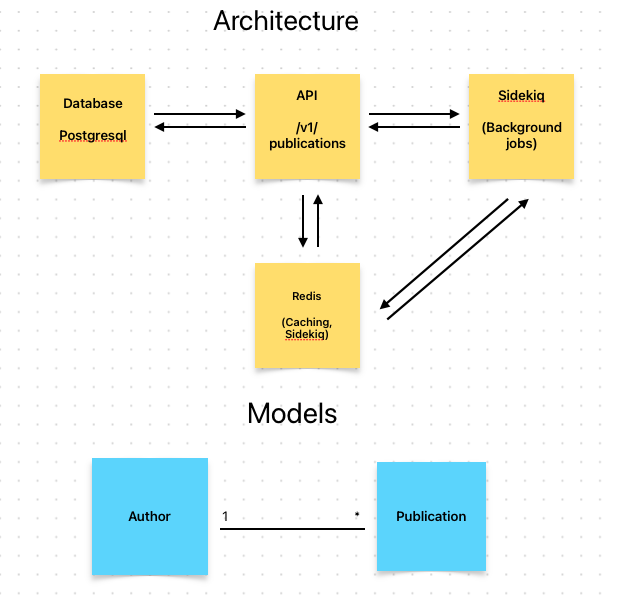

# S.E API Backend

API de listagem de Publicações.

- [Vídeo demo (ver em 1080p)](https://vimeo.com/1017105891?share=copy#t=0)

### Funcionalidades implementadas
- CRUD de publicações 
- Listagem de publicações por autores
- Paginação e ordenação em todos endpoints de listagem
- Envio de mensagem em background quando uma Publicação é alterada ou criada
- Aplicação de Cache no endpoint de Publicação
- Testes de unidade, integração e end-to-end
- Github Actions: testes e verificação do código

### Disclaimer

É importante destacar que, durante o desenvolvimento deste projeto, tomei algumas decisões apenas para demonstrar conhecimento em algumas ares. Para isso, criei regras de negócio além do descrito, adicionei recursos além do necessário e abri mão de alguns recursos de segurança para simplificar o uso da aplicação em qualquer máquina.  

*Recursos de segurança ignorados propositalmente:*
- Config. de CORS: acesso total;
- Acesso liberado para para todos os hosts;
- Variáveis de ambiente não ciptografadas;
- Não verificação, monitoramento e auditoria das dependências externas.

### Modelagem e Arquitetura do Sistema
A modelagem do projeto é simples: um autor pode ter várias publicações, e cada publicação pertence a um único autor. Essa relação é representada de forma clara no banco de dados relacional.

*Arquitetura*:
- Banco de dados relacional: PostgreSQL; 
- Banco de dados não relacional: Redis é utilizado para cache e background jobs;
- Sidekiq: Gerencia as tarefas em segundo plano.



#### Proposta de melhoria em um cenário real
Em um cenário real, onde essa aplicação recebesse um grande volume de requisições por segundo, sem considerar otimizações de infraestrutura, uma possível solução seria:
1. Alterar a modelagem: Poderia desnormalizar o banco de dados, colocando as Publicações e os dados do Autor em uma única tabela. Isso facilitaria consultas diretas, evitando a necessidade de joins, o que poderia melhorar o desempenho.

2. Uso de cache: Identificaria as Publicações mais visualizadas e as adicionaria ao cache, utilizando Redis, por exemplo. Dessa forma, seria possível fornecer respostas rápidas e acessar o banco de dados apenas quando estritamente necessário.

## Configuração do projeto
### Requisitos

- Docker e Docker Compose

### Como rodar a aplicação 
#### 1. Clone do repositório:

```bash
git clone https://github.com/douglasdoro/se_backend_ruby
cd se_backend_ruby
```
#### 2. Executar os containers:
A aplicação está configurada para rodar da forma mais simples possível. Todas as depenências, criação de banco de dados, dados para testes e demais serviços devem ser executados após rodar o comando:
```bash
docker-compose up
```
A API estará disponível em http://localhost:3000/up

Todos os endpoints estão disponíveis via [Swagger](http://localhost:3000/api-docs/index.html) ou podem ser importados no [Postman](https://www.postman.com/bold-eclipse-253666/se-backend/).

*Exemplo de chamada via CURL*
```bash
# Retorna uma lista de publicações
curl --location 'localhost:3000/v1/publications/' \
--header 'Accept: application/json'

```

### Testes

Para rodar os testes utilize o seguinte comando:
```bash
docker-compose exec test bin/rspec
# ou
 bin/rails-tests.sh
```
### Cache
O cache está implementado no endpoint `/v1/publications/:id` e pode ser ligado ou deligado com o comando: 
```bash
bin/rails-enable-cache.sh
```
Por padrão ele vem desligado. 

### Solução de problemas
Alguns dos comandos abaixo podem ajudar em caso de problema, mas se precisar de ajuda ou quiser tirar alguma dúvida sobre alguma decisão, fique a vontade para entrar em contato comigo. 

```bash
# Rodar migrações em caso de falha
docker-compose exec api bin/rails db:migrate

# Rodar Seeds
docker-compose exec api bin/rails db:seed

# Rodar linter
docker-compose exec api bin/rubocop

# Destruir todos os Containers e Volumes
bin/containers-down.sh

# Rocar o console do rails
bin/rails-console.sh
```


